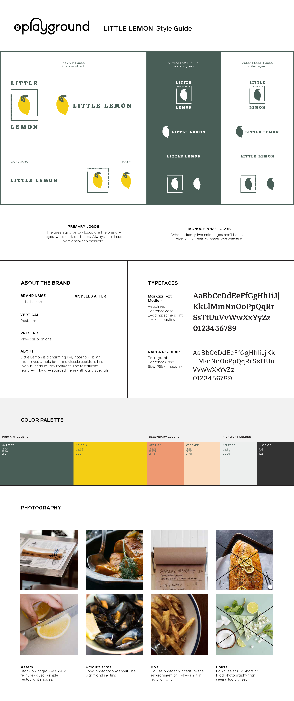
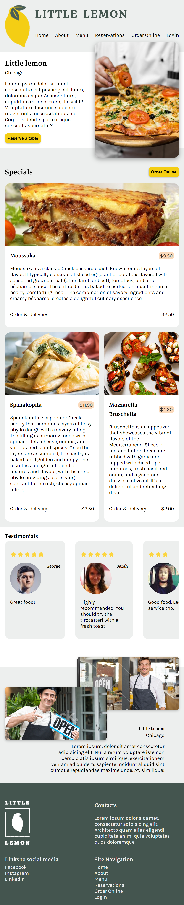
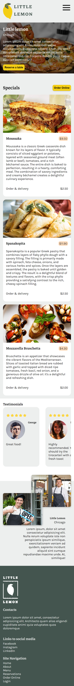

# Meta Frontend Specialization Capstone Project

## About
|   |   |
|---|---|
|This project involves creating a single-page application in React for an imaginary restaurant. The primary tasks revolve around designing a home page that adapts well to various screen sizes and implementing a reservation form for tables. Additionally, the project mandates adhering to a specific style guide while crafting the design. To achieve responsiveness, the strategy employed is to carefully contemplate the behavior of each component across various viewport sizes and establish unique styling rules and media queries for each individual component.||

|tablet|phone|
|------|-----|
|||

## API
Throughout the project's development, the supplied API was not functioning properly. Consequently, it became necessary to generate a custom "mock" API to enable the initiation and testing of the application within the framework of the project's specifications.

## How to start the application

This project was bootstrapped with [Create React App](https://github.com/facebook/create-react-app).

In the project directory, you can run:

### `npm start`

Runs the app in the development mode.\
Open [http://localhost:3000](http://localhost:3000) to view it in your browser.

The page will reload when you make changes.\
You may also see any lint errors in the console.

### `npm test`

Launches the test runner in the interactive watch mode.\
See the section about [running tests](https://facebook.github.io/create-react-app/docs/running-tests) for more information.

### `npm run build`

Builds the app for production to the `build` folder.\
It correctly bundles React in production mode and optimizes the build for the best performance.

The build is minified and the filenames include the hashes.\
Your app is ready to be deployed!

